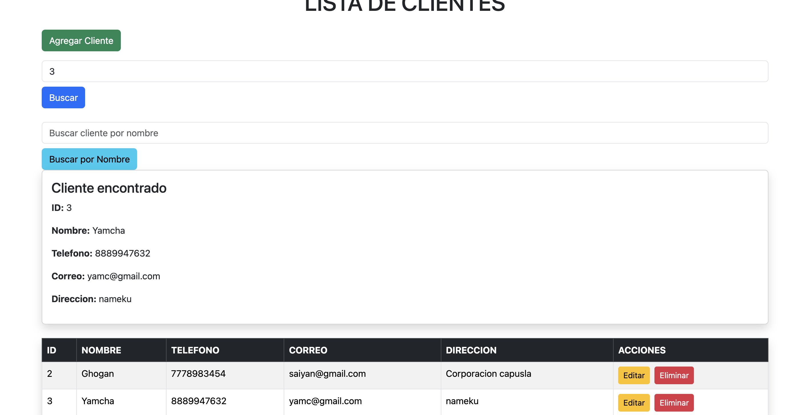
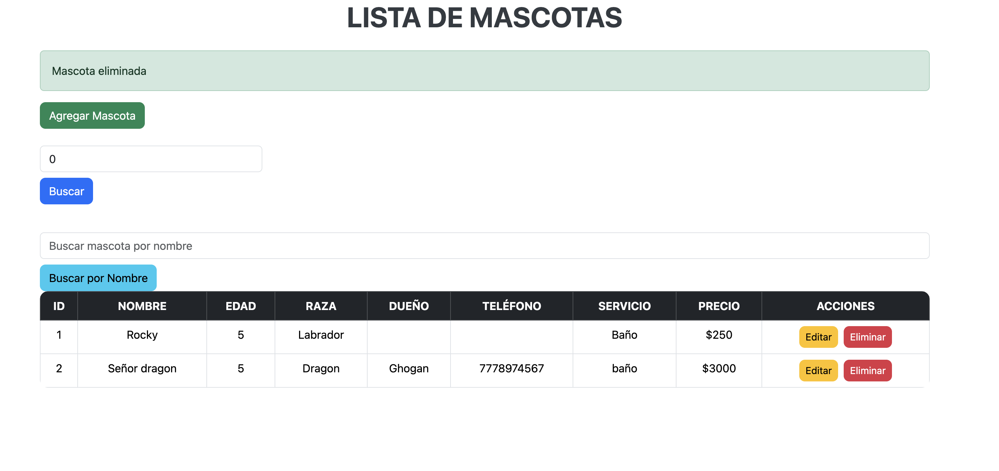
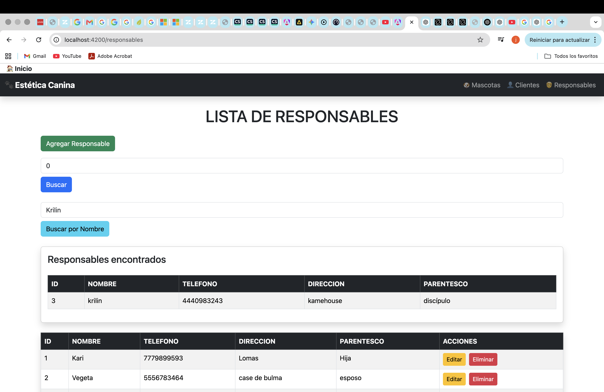

# 🐶 Sistema Estética Canina

Sistema web desarrollado con Angular y Spring Boot para la gestión de una estética canina.

## 🚀 Tecnologías utilizadas

- Java 17
- Spring Boot
- Spring Data JPA
- H2 Database
- Angular
- Bootstrap
- GitHub

## ✨ Funcionalidades

- CRUD de Mascotas
- CRUD de Clientes
- CRUD de Responsables
- Búsqueda por ID
- Búsqueda por Nombre
- Confirmación de eliminación
- Dashboard con contadores
- Diseño responsive

## 📸 Capturas

Dashboard

Clientes

Mascotas

Responsables

## 👨‍💻 Autor

Jaime Osornio
